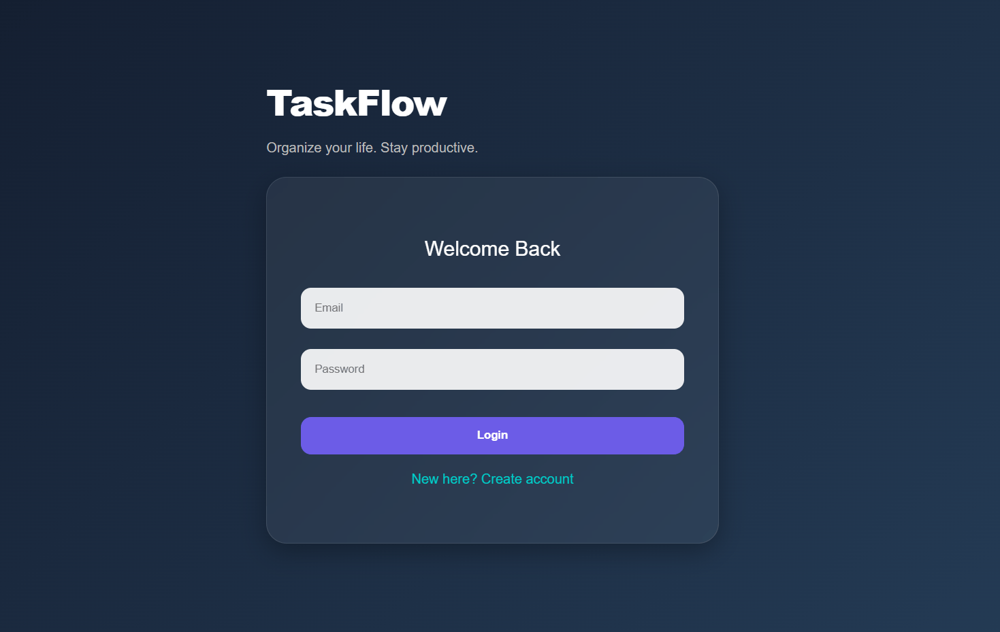
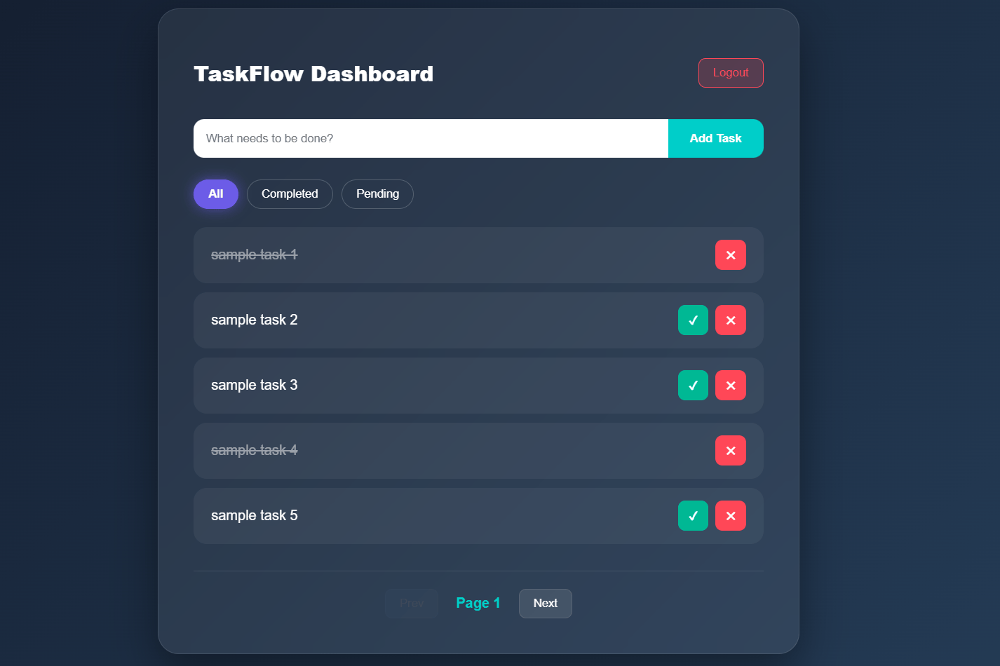
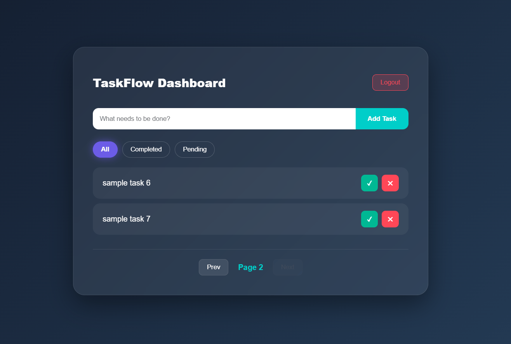

# Task Manager Web Application

### Login Page


### Dashboard




---
## Project Overview
- This is a simple full-stack Task Manager application built using FastAPI and React.
- It allows users to register, login, and manage their personal tasks securely using JWT authentication.
- The goal of this project is to demonstrate backend API development, authentication, database integration, and frontend interaction in a clean and simple way.

---
##  Features

### Authentication
- User Registration
- User Login
- JWT-based authentication
- Password hashing using bcrypt

### Task Management
- Create task
- View all tasks
- View single task
- Mark task as completed
- Delete task
- User-specific tasks (no access to others)

### Additional Features
- Task filtering (`completed / pending / all`)
- Pagination
- Responsive UI

---
##  Tech Stack
- Backend: FastAPI
- Database: SQLite
- ORM: SQLAlchemy
- Frontend: React (with Axios)
- Authentication: JWT

---
##  Project Structure

```text
task-manager/
├── assets/
├── backend/
│   ├── app/
│   │   ├── core/          # Auth logic and app configuration
│   │   ├── db/            # Database connection & session setup
│   │   ├── models/        # SQLAlchemy database models
│   │   ├── routes/        # API endpoints (Auth, Tasks)
│   │   ├── schemas/       # Pydantic data validation models
│   │   ├── main.py        # App entry point
|   |   └──.env            # Environment secrets
│   ├── requirements.txt   # Backend dependencies
│   ├── test_main.py       # API testing suite
│   └── test.db            # SQLite database file
├── frontend-react/        # React frontend
│   ├── src/
│   └── package.json
|
├── Dockerfile             # Container configuration
└── README.md
```

---
## Environment Variables
Create a `.env` file in the **backend** folder (Not Committed).

```env
# Database (SQLite for local development)
DATABASE_URL=sqlite:///./test.db

# Security Config & JWT Algorithm
SECRET_KEY=your_secret_key_here
ALGORITHM=HS256

# User session duration (in minutes)
ACCESS_TOKEN_EXPIRE_MINUTES=60
```

---
## How to Run Locally

### 1. Clone repository
```bash
git clone https://github.com/raagul666/task-manager.git
cd task-manager
```

### Backend Setup
```bash
cd backend
pip install -r requirements.txt
python -m uvicorn app.main:app --reload
```
- API URL: [http://127.0.0.1:8000]
- Interactive Docs: [http://127.0.0.1:8000/docs]

### Frontend Setup
```bash
cd frontend-react
npm install
npm start
```
- App URL: [http://localhost:3000]

---
### Docker Setup

- Run the backend in a isolated container:
```bash
docker build -t task-manager .
docker run -p 8000:8000 task-manager
``` 

---
### Live Deployment

- Backend(Deployed on Render): [https://task-manager-backend-1cwg.onrender.com/]
- Frontend(Deployed on Vercel): [https://task-manager-chi-lyart.vercel.app/]
- API Docs: [https://task-manager-backend-1cwg.onrender.com/docs]
- Live Demo: [https://task-manager-chi-lyart.vercel.app/]

---
##  Notes

- Deployed backend and frontend
- Secrets are stored using environment variables
- Each user can access only their own tasks
- Proper HTTP status codes are used
- Designed to be simple and functional

BY
- Raagul N
- [nraagul@gmail.com]